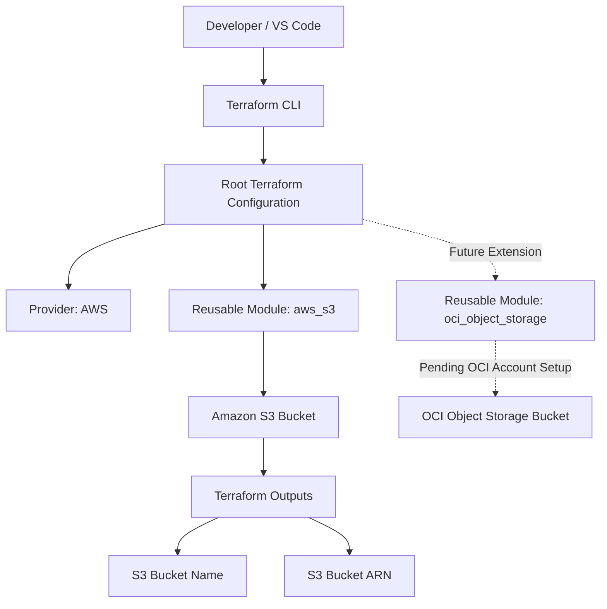

# 🚀 AWS S3 Terraform Module Lab

---

## 🧠 Project Story

This project started as a multi-cloud infrastructure lab designed to compare AWS S3 with Oracle Cloud Infrastructure (OCI) Object Storage.

During the build, OCI account access became a blocker, so the project was pivoted into a clean AWS-first Terraform deployment while preserving the OCI module as a future extension.

The final version demonstrates a real Infrastructure-as-Code (IaC) workflow using Terraform to provision an AWS S3 bucket with a modular project structure, reusable variables, tagging, outputs, validation, deployment proof, and GitHub documentation.

> ⚠️ OCI module is included for future extension but not deployed due to account limitations. Home Region availability for New Zealand is not present, and choosing different region does not allow bank card to be accepted to activate the account.

---

## 🎯 Why This Project Matters

Cloud engineers are expected to do more than click through the console.

This project demonstrates how infrastructure can be:

* defined as code
* validated before deployment
* deployed consistently
* documented with proof
* structured for future expansion

The goal was not only to create an S3 bucket, but to build the project in a way that reflects real cloud engineering practices.

---

## 💼 Practical Impact

This project demonstrates the ability to:

* Build production-style infrastructure using Terraform modules
* Maintain clean separation between configuration and reusable components
* Validate infrastructure before deployment to prevent issues
* Ensure infrastructure consistency using Terraform state and drift detection
* Follow secure Git practices by excluding sensitive files

These are core skills required for Cloud Support Engineer and Junior Cloud Engineer roles in real-world environments.

---

## 🧰 Tech Stack

* AWS (S3)
* Terraform
* Git & GitHub
* VS Code
* PowerShell / CLI

---

## 🏗️ Architecture & Deployment Flow



---

## 📂 Project Structure

```text
aws-to-oci-migration-lab/
│
├── modules/
│   ├── aws_s3/
│   │   ├── main.tf
│   │   ├── variables.tf
│   │   └── outputs.tf
│   │
│   └── oci_object_storage/
│       ├── main.tf
│       ├── variables.tf
│       └── outputs.tf
│
├── docs/
│   └── screenshots/
│
├── main.tf
├── providers.tf
├── variables.tf
├── locals.tf
├── outputs.tf
├── versions.tf
├── terraform.tfvars.example
├── .gitignore
└── README.md
```

---

## ⚙️ Deployment Steps

```bash
terraform init
terraform validate
terraform plan
terraform apply
```

---

## ✅ Deployment Result

* AWS S3 bucket successfully created via Terraform
* Outputs generated:

  * Bucket Name
  * Bucket ARN

Example:

```
aws_s3_bucket_name = "him-aws-to-oci-lab-dev-001"
aws_s3_bucket_arn  = "arn:aws:s3:::him-aws-to-oci-lab-dev-001"
```

---

## 📸 Proof (Screenshots)

Located in:

```
docs/screenshots/
```

Includes:

* Terraform init / validate / apply
* S3 bucket creation in AWS Console
* Module structure and configuration

---

## 🔒 Security Notes

The following are intentionally excluded from version control:

* `.terraform/`
* `terraform.tfstate`
* `terraform.tfvars`

This follows Terraform and Git best practices for protecting sensitive data.

---

## 🔮 Future Enhancements

* Enable OCI Object Storage module once account access is available
* Add remote backend (S3 + DynamoDB) for state management
* Implement CI/CD pipeline for Terraform deployment
* Add versioning, encryption, and lifecycle policies to S3 bucket

---

## 👨‍💻 Author

Himanshu
Cloud Engineering Graduate | AWS | Terraform | DevOps Foundations

---
